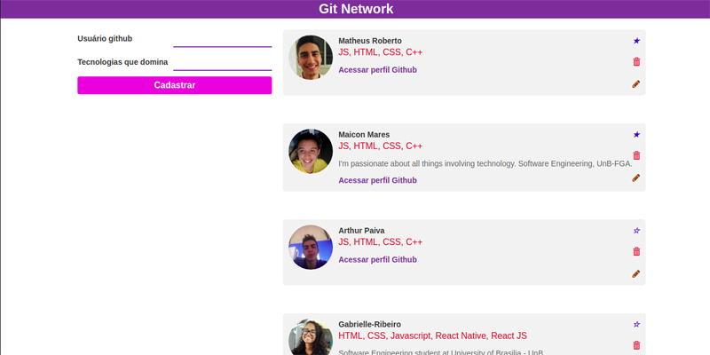
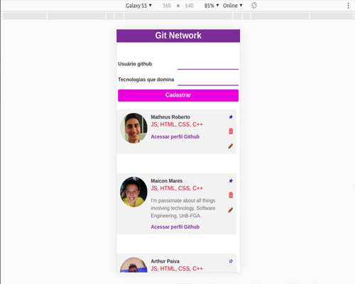
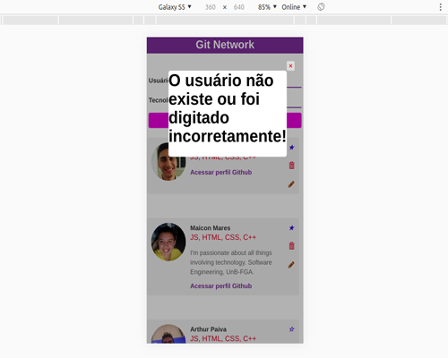

# Git_Network
## About
An application built with ReactJS and NodeJS + Express + MongoDB (Atlas). The purpose of this app is learn how to consume data of an extern API, capture and store them into an online database.
## Application working in image below. It's a well-known CRUD.

<h3>A responsive application made for large and small screens:</h3>

## Getting started
### Prerequisites

1. Git
2. Yarn: see <a href="https://classic.yarnpkg.com/en/docs/install/#windows-stable">yarn website for installation instructions</a>
3. Node: any 12.x version starting with 12.0 or greater
4. A fork of this repo
5. ReactJS: see <a href="https://reactjs.org/docs/getting-started.html">ReactJS.org for installation in your local machine</a>

### Installation - frontend
1. cd Git_Network/frontend/git_network to go to the frontend directory.
2. run **_yarn_** to install the npm dependencies

### Installation - backend
1. cd Git_Network/backend/ to go to the backend root directory.
2. run **_npm install_** to install Node dependencies.

### Running locally
#### Frontend
1. Inside Git_Network/frontend/git_network directory, run **_yarn start_** to start the development server. After, automatically a web page will opened in your browser.
#### Backend
1. In the backend's root directory (Git_Network/backend/), run **_npm run dev_** to start the backend server.

## Observations

  
<i>:warning:</i> It's probably, sometimes, you will can't access the MongoDB online database, because he's protected by extern IP's.
  

Note</h2>

I will really enjoy if you fork my repository, make pull requests and give me tips about how I can improve my software engineering skills.

